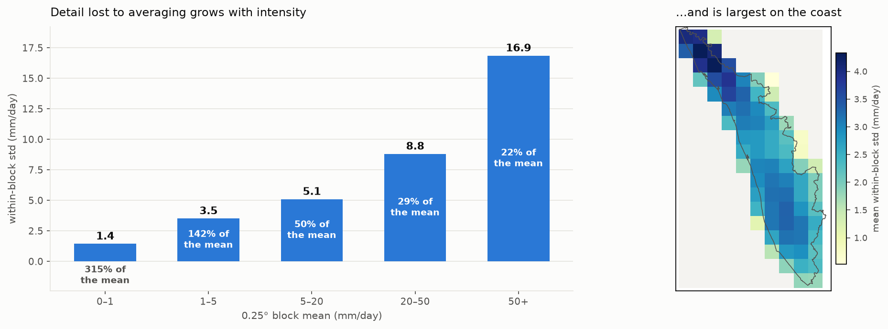
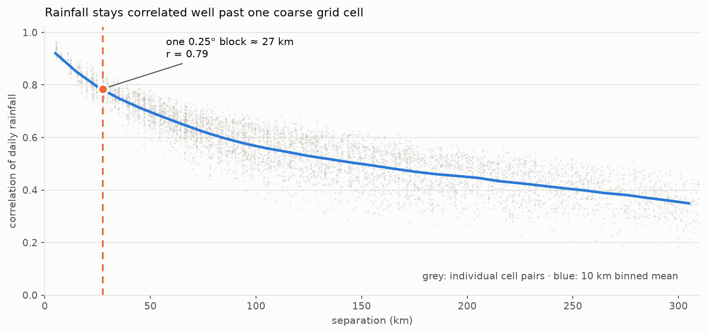

# Kerala CHIRPS Rainfall Downscaling

Downscaling daily CHIRPS rainfall over Kerala from 0.25° to its native 0.05°
resolution using a self-supervised super-resolution GAN, 1996–2025.

## Layout

```
├── notebooks/
│   ├── 01_data_pipeline.ipynb   raw CHIRPS → clipped → paired LR/HR arrays
│   ├── 02_eda.ipynb             exploratory analysis of the rainfall record
│   └── 03_model.ipynb           model defs → train → evaluate → figures → diagnostics
├── results/        checkpoints/, test_metrics.json, diagnostics.json, history.json, train.log, scaler.json
├── figures/        eda_*.png (6), predicted_vs_actual.png, diagnostics.png
├── docs/REPORT.md  code + results review
└── Downscaling/    data root
    ├── chirps/                        30 raw global yearly CHIRPS files (0.05°, ~33GB)
    ├── chirps_1996_2025_clipped.nc    combined + clipped to Kerala (10,958 days, 91×52)
    ├── paired_data.npz                LR/HR training pairs
    └── state.geojson                  Kerala boundary
```

## Method

**`01_data_pipeline.ipynb`** combines the 30 raw yearly CHIRPS files and clips them
to the Kerala boundary — 10,958 days, 1996–2025, no gaps, 91×52 at 0.05°. This is
the single data source everything else builds on. It then crops that grid to a
clean multiple of 5 (90×50) and block-averages it down to an 18×10, 0.25° "low-res"
field. Because the low-res
field is derived from the high-res field, the pairing is self-supervised: no
second dataset and no cross-sensor bias to fight, just detail recovery. The
average is taken over in-mask cells only, so at the 45 of 78 blocks that straddle
the coast or border it is a masked mean rather than a plain 5×5 mean — see
[finding 2](docs/REPORT.md#2--the-consistency-loss-is-also-wrong-on-58-of-the-domain).

**`02_eda.ipynb`** characterises the rainfall record before any modelling — see
[What the data looks like](#what-the-data-looks-like) below.

**`03_model.ipynb`** implements an SRResNet-style generator (`PixelShuffle(5)` for
the exact 5× upsample, global skip to the nearest-upsampled input, plus a
downsample-consistency loss) with a PatchGAN discriminator conditioned on the
upsampled LR, then trains, evaluates and diagnoses it. Split is chronological:
train 1996–2018, val 2019–2021, test 2022–2025.

## Getting the data

No rainfall data is committed — the raw CHIRPS archive is ~33 GB, and everything
derived from it is rebuilt by notebook 01. Only `Downscaling/state.geojson` (the
Kerala boundary) is in the repo.

To reproduce from scratch:

```bash
mkdir -p Downscaling/chirps
cd Downscaling/chirps
for y in $(seq 1996 2025); do
  wget "https://data.chc.ucsb.edu/products/CHIRPS-2.0/global_daily/netcdf/p05/chirps-v2.0.$y.days_p05.nc"
done
```

Then open `notebooks/01_data_pipeline.ipynb`, set `RUN_CLIP = True` in step 1, and run
it. Step 1 clips the global files to Kerala (`chirps_1996_2025_clipped.nc`, ~25 MB) and
step 2 builds the training pairs (`paired_data.npz`, ~20 MB). Both are gitignored.

Data source: [Climate Hazards Center, UC Santa Barbara](https://www.chc.ucsb.edu/data/chirps)
— CHIRPS v2.0 global daily, 0.05° resolution.

The committed notebooks are stored **with their outputs**, so every figure, metric and
printed result is readable on GitHub without downloading anything.

## Setup

Python 3.12, environment at `~/myenv`, CUDA GPU for training.

```
pip install -r requirements.txt
```

## How to run

```
jupyter lab notebooks/
```

Run the notebooks in order. Each resolves its own paths, so they work from either
the `notebooks/` folder or the project root. `02_eda.ipynb` is read-only apart from
the figures it writes — nothing downstream depends on it.

Two flags guard the expensive, destructive steps — both default to `False`, so
running all cells reproduces the existing results without rebuilding anything:

| Flag | Notebook | Set `True` to |
|---|---|---|
| `RUN_CLIP` | 01, step 1 | rebuild `chirps_1996_2025_clipped.nc` from the 33 GB raw archive (slow) |
| `RETRAIN` | 03, section 3 | retrain from scratch, overwriting `results/checkpoints/best.pt` (~10 min on GPU) |

## What the data looks like

`02_eda.ipynb` characterises the record and connects each property to a modelling
decision. Six sections; the parts that matter for reading the results:

| Property | Value | Consequence |
|---|---|---|
| Zero-inflation | 67% of cell-days exactly 0 | `log1p` transform; −1 encodes "no rain" |
| Skewness | 4.5, max 578 mm/day | mm-space RMSE is tail-dominated |
| Seasonality | Jun–Jul ≈ ⅓ of the year | most training batches are near-dry |
| Spatial range | 936 → 4,001 mm/yr (4.3×) | fine structure is systematic, not noise |
| Test years | +1.8% vs record | test metrics are not flattered |
| **Val years** | **+6.7% vs record** | **checkpoint selected on a wet-leaning period** |
| Within-block CV | 0.86 | discarded signal ≈ retained signal |
| Correlation at 28 km | 0.78 | task is learnable — but blur scores well |



**The size of the problem.** Each 0.25° cell averages 25 real 0.05° cells. On a block
averaging 5–20 mm/day the cells inside it differ by about 5 mm — half the block mean —
and on the wettest blocks the spread reaches 17 mm. Averaged over everything the
within-block coefficient of variation is 0.86: the sub-grid signal is roughly as large
as the signal that survives. Repeating the block mean, as nearest-upsampling does,
discards a quantity comparable to what it keeps.



**Why the baselines are hard to beat.** Daily rainfall correlates at r = 0.92 between
neighbouring 0.05° cells and still r = 0.78 across a full 0.25° block. That cuts both
ways: the task is learnable, because sub-grid detail is tied to its surroundings — but
simply repeating the block mean is already a strong pointwise predictor, which is how
nearest-upsampling reaches RMSE 7.12 and R² 0.84 while inventing nothing at all.

Two findings worth carrying into the results:

1. **The validation period is 6.7% wetter than the record**, and that is where the
   checkpoint is selected — a mild bias toward epochs that handle heavy rain. The test
   years are close to typical (+1.8%), so the reported metrics themselves are fine.
2. **Totals and extremes peak on the northwest coast, but wet-day frequency peaks
   inland in the south.** Intensity and occurrence are different spatial problems,
   which is why they are scored separately.

## Current results

Test set 2022–2025, 1,461 days, masked cells only. Best checkpoint: epoch 18.

**Structure, occurrence and extremes** — what a rainfall downscaler has to get right:

| | within-block std ↑ | wet-day CSI ↑ | FAR ↓ | p99 | p99.9 |
|---|---|---|---|---|---|
| **True CHIRPS** | 2.872 | — | — | 87.21 | 163.58 |
| GAN | **1.854** | **0.863** | **0.091** | **83.45** | **151.11** |
| Nearest upsample | 0.000 | 0.779 | 0.212 | 80.50 | 144.59 |
| Bilinear upsample | 1.053 | 0.737 | 0.224 | 77.21 | 130.61 |

The GAN recovers 65% of the true sub-grid variability, against 37% for bilinear
and 0% for nearest (which has none by construction). It is the only method that
places wet and dry cells near the true frequency — 0.364 against a true 0.350,
where the interpolators smear rain out to 0.437 and 0.445 — and the only one that
holds on to the extremes.

**Pointwise error** — where smoothing wins:

| | MAE ↓ | RMSE ↓ | corr ↑ | R² ↑ |
|---|---|---|---|---|
| GAN | **2.235** | 7.600 | 0.908 | 0.821 |
| Nearest upsample | 2.527 | 7.117 | 0.918 | 0.843 |
| Bilinear upsample | 2.554 | **6.932** | **0.924** | **0.851** |

The GAN wins MAE; the interpolators win RMSE, correlation and R². These metrics
reward blur, which is the PSNR-versus-perceptual trade-off documented since the
original SRGAN paper — a real cost, not a bug, and not the scoreboard for this task.

## Known issues

`docs/REPORT.md` has the full review. The three that matter most:

1. The downsample-consistency loss (`03_model.ipynb` §3) pools in log1p-scaled space
   while the LR field is a mean in mm. A perfect model would score 0.1065 on it;
   weighted at λ=50, it spent training rewarding blur.
2. The same loss divides every block by 25, while the LR field divides by the
   valid-cell count — a mismatch on 45 of 78 blocks.
3. Best validation loss lands at epoch 18 of 150, and checkpoint selection uses a
   pixel metric, which picks the checkpoint where the adversarial term has done
   least. The reported model is likely below this architecture's ceiling.

The notebooks reproduce the existing behaviour exactly — none of these are fixed.
Each is flagged in a markdown cell next to the code it affects.

## Notes

- `Downscaling/chirps/` is 33GB of raw source data, kept as the archival copy
  `chirps_1996_2025_clipped.nc` was built from.
- Earlier work explored downscaling from ERA5 reanalysis and comparing against IMD
  gridded rainfall; that work and those data sources have been removed — this
  project's scope is CHIRPS 0.25°→0.05° only.
