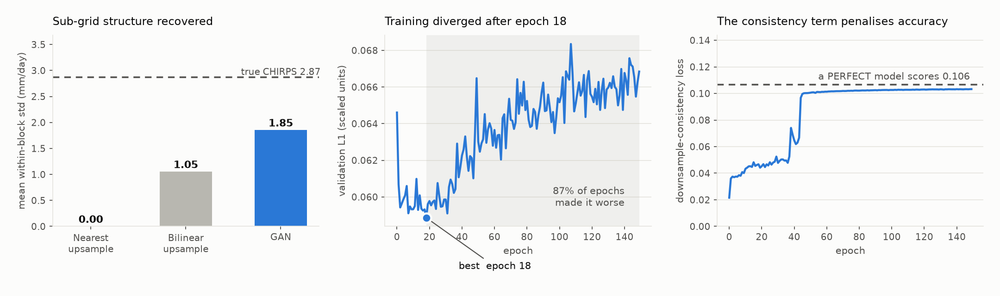

# Review — Kerala CHIRPS rainfall downscaling

Reviewed 2026-08-23. Scope: the full pipeline, the trained checkpoint
(`results/checkpoints/best.pt`), and the reported results. Every number below is
reproduced by `notebooks/03_model.ipynb` §6 and written to `results/diagnostics.json`.

Code references point at notebook sections. The pipeline was converted from scripts
to two notebooks after this review; the conversion preserved behaviour exactly, and
every finding below still stands.

---

## Verdict

**The model works better than the README says it does.** The headline table leads
with RMSE/R², concludes the naive baseline "edges it out", and treats that as a
cost to be excused. That is the wrong headline: on the three things a rainfall
downscaler actually has to do — invent sub-grid structure, place wet and dry
cells correctly, and preserve extremes — the GAN beats every baseline decisively,
and the margins are large.

**But the result was produced despite the training setup, not because of it.**
Two defects in the loss and one in model selection mean the reported checkpoint
is epoch 18 of 150, and the physical constraint the design leans on is being
measured in a space where it cannot hold.

---

## What the pipeline does

CHIRPS v2.0 daily rainfall, 1996–2025, clipped to Kerala (91×52 cells at 0.05°),
cropped to 90×50 and block-averaged 5×5 down to an 18×10 "0.25°" field. The model
learns the inverse map. Because the low-res field is derived from the high-res
field, the pairing is self-supervised — no second dataset, no cross-sensor bias.

SRResNet generator (8 residual blocks, one `PixelShuffle(5)`, global skip to the
nearest-upsampled input), PatchGAN discriminator conditioned on the upsampled LR.
Loss = adversarial + 100 × masked L1 + 50 × downsample-consistency. Chronological
split: train 1996–2018 (8,401 days), val 2019–2021 (1,096), test 2022–2025 (1,461).

The self-supervised framing is the right call and the exact-integer factor 5 with
`PixelShuffle` is a clean piece of design. The chronological split and train-only
scaler fit are both correct — no leakage.

---

## Results, restated

Test set 2022–2025, 1,461 days, masked cells only.

### Pointwise error — the baselines win

| | MAE ↓ | RMSE ↓ | corr ↑ | R² ↑ |
|---|---|---|---|---|
| GAN | **2.235** | 7.600 | 0.908 | 0.821 |
| Nearest upsample | 2.527 | 7.117 | 0.918 | 0.843 |
| Bilinear upsample | 2.554 | **6.932** | **0.924** | **0.851** |

### Structure, occurrence, extremes — the GAN wins

| | within-block std ↑ | wet-day CSI ↑ | FAR ↓ | p99 | p99.9 |
|---|---|---|---|---|---|
| **True CHIRPS** | 2.872 | — | — | 87.21 | 163.58 |
| GAN | **1.854** | **0.863** | **0.091** | **83.45** | **151.11** |
| Nearest upsample | 0.000 | 0.779 | 0.212 | 80.50 | 144.59 |
| Bilinear upsample | 1.053 | 0.737 | 0.224 | 77.21 | 130.61 |

*Within-block std* is the mean spatial standard deviation **inside** each 5×5
block — precisely the detail super-resolution exists to recover, and precisely
what nearest-upsampling has none of, by construction. *CSI* is the critical
success index at 1 mm/day.

Read together: the GAN recovers 65% of the true sub-grid variability where the
best interpolation recovers 37% and nearest recovers 0%. It is the only method
that gets wet-day frequency close to truth (0.364 vs 0.350; the interpolators
smear rain to 0.437 and 0.445, giving false-alarm rates 2.3× higher). It is
closest to truth at both the 99th and 99.9th percentile.

RMSE and R² reward blur — this is the PSNR-versus-perceptual trade-off, and the
README names it correctly. The mistake is presenting the blur-rewarding metrics
as the scoreboard and the structural win as an excuse.



---

## What the data says

`02_eda.ipynb` characterises the record before any modelling. Three of its results
change how the headline table should be read.

**The sub-grid signal is as large as the signal that survives.** Each 0.25° cell
averages 25 real 0.05° cells. On blocks averaging 5–20 mm/day the cells inside differ
by ~5 mm — half the block mean — and on the wettest blocks the spread reaches 17 mm.
Across the whole record the within-block coefficient of variation is **0.86**. Nearest
upsampling discards a quantity comparable to what it keeps, which is what makes
"within-block std" the right primary metric rather than a consolation prize.


**High spatial coherence is why the baselines are so hard to beat.** Daily rainfall
correlates at r = 0.92 between neighbouring 0.05° cells and still **r = 0.78 across a
full 0.25° block**. Rainfall does not decorrelate anywhere near the block scale, so
simply repeating the block mean is already a strong pointwise predictor of every cell
inside it. That is how nearest upsampling reaches RMSE 7.12 and R² 0.84 while inventing
nothing at all.


This is the quantitative backing for finding 4. On data this spatially coherent, RMSE
cannot distinguish a model that recovers structure from one that declines to try — the
blur is *nearly as good pointwise* by construction of the field itself, not by accident
of this particular model.

**The validation period is 6.7% wetter than the record.** Test years are close to
typical (+1.8%), so the reported test metrics are neither flattered nor penalised. But
checkpoint selection happens on val, and 2019–2021 lean wet — a mild bias toward
whichever epoch handles heavy rain best. Small next to finding 1, but it compounds with
finding 3: the selection criterion is already the wrong one, and it is being applied on
an unrepresentative period.

| | mean annual rainfall | vs record |
|---|---|---|
| Record 1996–2025 | 2,823 mm | — |
| Train 1996–2018 | 2,789 mm | −1.2% |
| **Val 2019–2021** | **3,010 mm** | **+6.7%** |
| Test 2022–2025 | 2,874 mm | +1.8% |

Two further properties worth carrying: the record is **67% exact zeros** with skewness
4.5, which is why mm-space RMSE is dominated by the tail; and totals and extremes peak
on the northwest coast while wet-day *frequency* peaks inland in the south, so intensity
and occurrence are genuinely different spatial problems.

---

## Findings

### 1 — The downsample-consistency loss is computed in the wrong space

`downsample_consistency` (`03_model.ipynb` §3) pools the generator output with `avg_pool2d` and compares it to the
LR input **in log1p-scaled units**. But the LR field is a 5×5 arithmetic mean in
**mm/day**. Because `log1p` is concave, `mean(log1p(x)) ≠ log1p(mean(x))`, so the
loss measures a Jensen gap that no correct model can close.

A *perfect* generator — one that reproduces true CHIRPS exactly — scores **0.1065**
on this loss. The selected checkpoint scores 0.0467; the final epoch scores 0.1032.
The training curve rises monotonically toward the floor as the model gets more
accurate. Weighted at λ=50, the term spent the whole run rewarding blur and
penalising correctness. It is the single largest defect here.

**Fix:** invert to mm before pooling, or supply the LR target pre-transformed the
same way the pooling produces it.

### 2 — The consistency loss is also wrong on 58% of the domain

`avg_pool2d` (`03_model.ipynb` §3) divides every block by 25. `01_data_pipeline.ipynb`
step 2 builds the LR field by dividing by the count of *valid* (in-mask) cells. Of the 78 LR blocks that carry
data, only **33 are fully inside the Kerala mask**; 45 are partial coast/border
blocks where the two definitions disagree — by 3.23 mm/day on average and up to
465 mm/day. This is independent of finding 1 and survives fixing it.

**Fix:** pool sums and divide by the per-block valid count, matching step 2 of
`01_data_pipeline.ipynb`.

### 3 — 87% of training made the model worse, and the selection criterion fights the model's purpose

Best validation L1 lands at **epoch 18 of 150**. No later epoch beats it; the final
epoch is 13.6% worse. Nine of the ten training minutes were spent overfitting.

The deeper problem: checkpoint selection uses validation **L1**, a pixel metric.
The GAN's entire value is structural. Selecting on L1 systematically picks the
checkpoint where the adversarial signal has done the *least* work — so the reported
model is the least-GAN GAN available. That the structural numbers are still this
strong at epoch 18 suggests the ceiling is higher than what is reported.

**Fix:** early-stop on the pixel metric, but select on a composite that includes
within-block std error or CSI. Then re-run — it costs ten minutes.

### 4 — The headline undersells the work, and the baseline set is incomplete

The README's two-row table omits bilinear interpolation, the strongest pointwise
competitor (RMSE 6.932, R² 0.851 — it beats both the GAN and nearest). Including
it makes the pointwise picture *worse*, which is exactly why it belongs there —
and it makes the structural result far more convincing, because bilinear is the
method that trades most aggressively for smoothness and is the worst of all four
at wet-day CSI (0.737).

**Fix:** lead with structure/occurrence/extremes, report pointwise error as
secondary with all three baselines, and state the trade-off as a finding rather
than a defence.

### 5 — The "physically exact by construction" claim is overstated

The README states every LR/HR pair is "an exact 5×5 average of the true field, so
every LR/HR pair is physically consistent by construction". True for 33 of 78
blocks (42%). The remaining 45 use a masked mean over a variable number of cells —
still a defensible definition, but not the plain block average the text describes,
and the discrepancy is what finding 2 turns into a training bug.

### 6 — Generator output is hard-capped at the training-set maximum

`Scaler` (`03_model.ipynb` §1) fixes `scale = log1p(max(train HR))` = 6.362, and both
the generator (§2) and `Scaler.inverse` clamp to [-1, 1]. The model therefore cannot
emit more than **578.37 mm/day**, ever. On this test set that is survivable — true
max is 527.94 — but 30 predicted cell-days already sit at the ceiling, and a wetter
evaluation period, or an extrapolation use case, would clip real extremes silently.

**Fix:** fit the scale on a high quantile (e.g. p99.99) rather than the max and
allow the output to exceed 1.0, or clamp only the lower bound.

### 7 — Bias correction is computed, reported, and makes things worse

`03_model.ipynb` §4 estimates a validation bias (−0.151 mm/day) and applies it to the
test set. It reduces bias to −0.012 as intended but raises MAE from 2.235 to 2.325
and leaves RMSE unchanged. The correction is reported alongside the raw numbers
without a decision. Either drop it or state that raw is the reported configuration.

### 8 — The figure does not show what the README says it shows

The README claims "visual inspection on **wet test days**". the sampling cell in `03_model.ipynb` §5
samples uniformly at random from the test set (`WET_ONLY = False`). Kerala rainfall is intermittent, so
6 of the 8 sampled days are near-dry. Worse, `vmax` is set per row from that day's
single wettest cell, so on 2022-07-14 (vmax ≈ 550) the entire field renders as
blank cream. Only two rows — 2024-05-10 and 2024-05-27 — actually demonstrate
anything, and on those two the GAN's advantage is plainly visible.

**Fix:** set `WET_ONLY = True` and `VMAX_PERCENTILE = 99` in §5 — both knobs are
already exposed at the top of that cell, defaulted to reproduce the original figure.

### 9 — Housekeeping

- The training loop runs the generator forward twice per batch (`03_model.ipynb` §3);
  detaching the first would halve that cost.
- The discriminator never receives the land mask, so part of its capacity goes to
  learning Kerala's outline instead of rainfall texture.
- The project was not under version control and had no pinned dependencies.

---

## What I changed

Two passes, both **behaviour-preserving** — no model, loss, or evaluation logic was
altered in either.

**Pass 1 — reorganisation.** Scripts, results and figures split into `src/`,
`results/` and `figures/`, with paths declared once.

**Pass 2 — conversion to notebooks**, at your request. The six scripts became two
end-to-end notebooks and `src/` was removed. An EDA notebook was added alongside them
and the model notebook renumbered to `03_`. Verified by executing both notebooks
top to bottom: `paired_data.npz` came out byte-identical, every number in
`diagnostics.json` matched exactly, and `test_metrics.json` moved by at most
4×10⁻⁵ — float non-determinism from batching inference at 256 instead of one day at
a time, well below reported precision. The checkpoint was not touched.

```
dushyant/
├── README.md                        rewritten for the notebook layout
├── requirements.txt                 pinned from the working environment
├── docs/REPORT.md                   this document
├── notebooks/
│   ├── 01_data_pipeline.ipynb       clip + combine → paired LR/HR arrays
│   ├── 02_eda.ipynb                 exploratory analysis of the rainfall record
│   └── 03_model.ipynb               defs → train → evaluate → figures → diagnostics
├── results/                         checkpoints/, metrics, history, log, scaler
├── figures/                         eda_*.png (6), predicted_vs_actual.png, diagnostics.png
└── Downscaling/                     data root — 33GB raw archive left untouched
```

- Both notebooks resolve their own paths, so they run from `notebooks/` or from the
  project root with no `sys.path` juggling and no `.py` imports.
- `RUN_CLIP` (notebook 01) and `RETRAIN` (notebook 02) both default to `False`, so a
  run-all reproduces the existing results instead of rebuilding the 33 GB clip or
  overwriting `best.pt`.
- Findings 1, 2, 3, 6, 7 and 8 are each flagged in a markdown cell directly above the
  code they affect, so the caveat travels with the code.
- Section 6 of notebook 03 computes every number in the results section and writes
  `results/diagnostics.json` and `figures/diagnostics.png`; `02_eda.ipynb` produces the
  six `figures/eda_*.png`.

## Recommended order of work

1. Fix the consistency loss — space (finding 1) and masking (finding 2).
2. Change checkpoint selection to a structure-aware criterion (finding 3), re-run.
3. Re-fit the scaler off a quantile (finding 6).
4. Rewrite the results section around structure/occurrence/extremes with all
   three baselines (findings 4, 5).
5. Flip `WET_ONLY` and `VMAX_PERCENTILE` in §5 so the figure shows the comparison
   (finding 8).
6. `git init`.

Items 1–3 are the ones likely to move the numbers.
